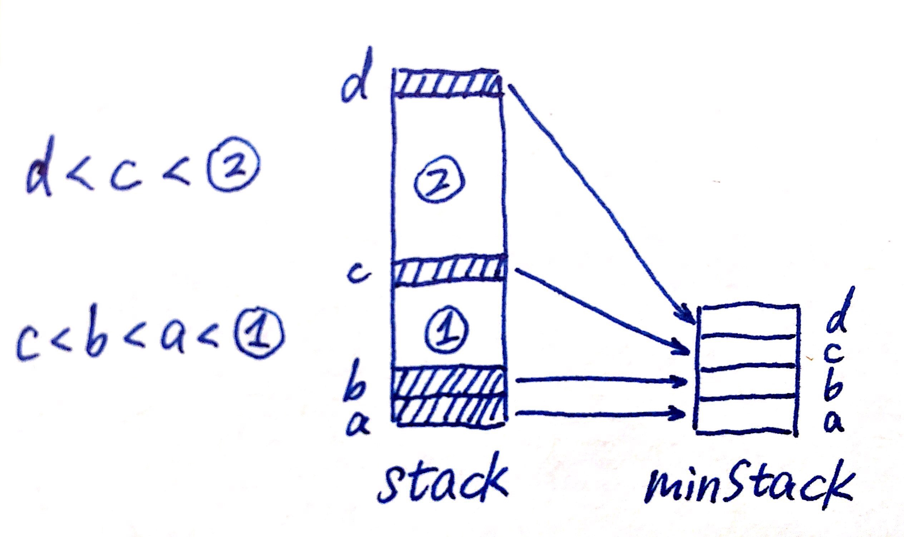

# 155. Min Stack

基础结构：两个stack，一个当普通stack使用，另一个只push目前最小的元素，保持栈顶始终是目前最小元素。

功能实现：

1. push：无论如何都要放进普通stack。和minStack.peek()比较，如果新元素更小，就放进minStack，如果一样大，也要放进去（保证出现duplicate时，就算其中一个被pop出去了也不会丢失最小值，举例：push 2，push 1，push 1，pop 1，此时最小还是1，需要仍然有1在minStack顶）。
2. pop：无论如何都要从普通stack pop。要不要从minStack pop要看top是不是目前最小值，不是的话minStack不需要处理，是的话从minStack中pop栈顶。
3. top：直接peek普通stack。
4. getMin：由于我们保证minStack栈顶始终是目前存在元素的最小值，只要peek minStack即可。

注意：不需要担心有些元素并没有放进minStack：




阴影元素为最小值出现为止，即每个最小值都<=下方所有元素。d被pop出去之后，c是留下所有元素中的最小值，对section 2的pop, top操作不对stack和minStack中的d产生影响，当getMin时，c还在minStack栈顶，所以被正确返回。

```java
class MinStack {

    Stack<Integer> stack;
    Stack<Integer> minStack;
    
    /** initialize your data structure here. */
    public MinStack() {
        stack = new Stack<Integer>();
        minStack = new Stack<Integer>();
    }
    
    public void push(int x) {
        stack.push(x);
        if(minStack.isEmpty() || x <= minStack.peek()){
            minStack.push(x);
        }
    }
    public void pop() {
        int top = stack.pop();
        if(!minStack.isEmpty() && minStack.peek() == top) {
            minStack.pop();
        }
    }
    
    public int top() {
        return stack.peek();
    }
    
    public int getMin() {
        return minStack.peek();
    }
}
```