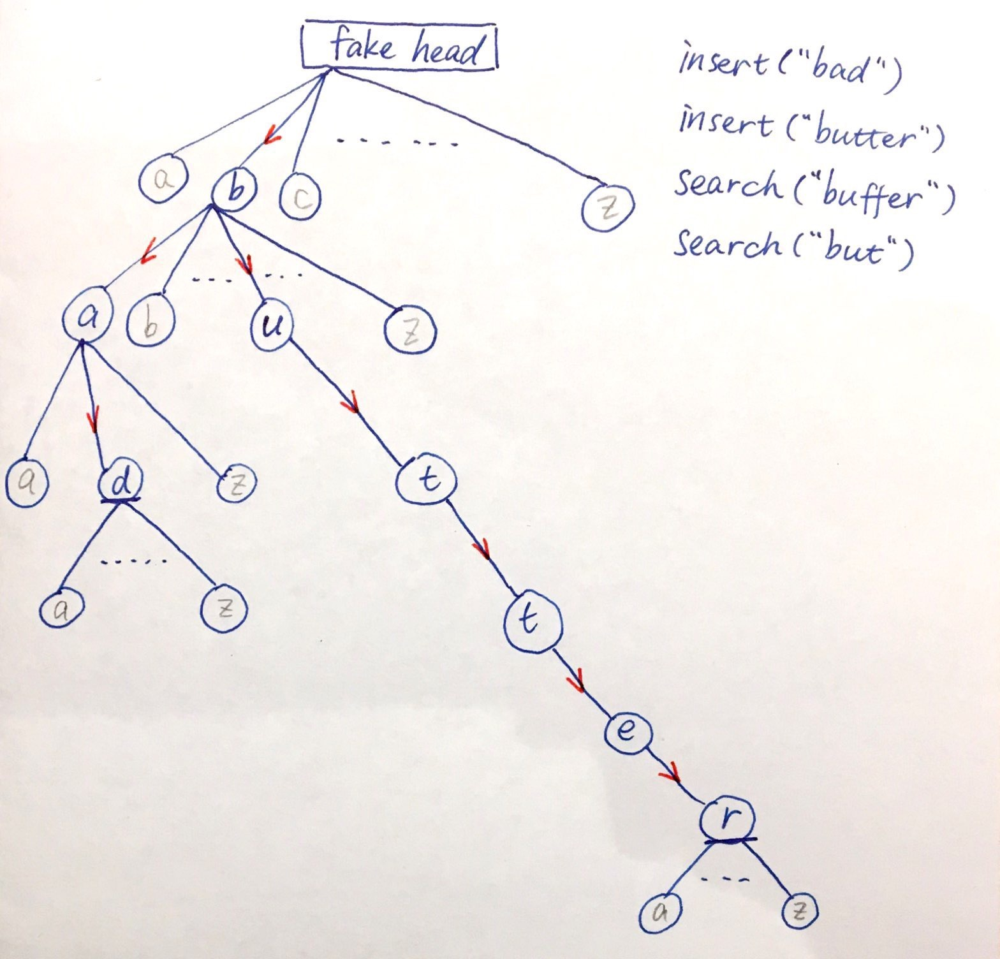

# 208. Implement Trie (Prefix Tree)

基础结构：Trie

功能实现：

Trie是字典树，每个node都有26个children(a~z)。注意这个26个字母在一开始只是26个空位置（表现为Character[26]，里面是26个null），往Trie里添加word时才会被初始化（把abcd放进array里）。

当要添加一个word或者查找一个word时，就从第一个字母开始顺着走下去，每个字母对应Trie的一层。添加word时，children里有下一个字母就走过去，没有的话(null)就初始化然后走过去。这样一直把word里的每一个字母都放好。查找word时，也一样顺着往下走，没有找到next letter这个孩子时就结束了。找到word最后一个字母发现全都有时，还要检查是否真的有word在此结束：题目要求完全匹配（word.lastLetter必须是被标明tail的节点），或是prefix形式也可以（last letter不一定是被标明tail的节点）。

看图，铅笔是暂时不存在的孩子节点，蓝色是已经生成的节点。insert了两个单词(bad, butter)之后，我们有了部分重叠的两条边，并且在第三层的'd'和第六层的'r'标记了tail，说明我已有的单词里有在这里结尾的。搜索buffer这个单词时，在第二层的'u'处找不到'f'这个孩子，中断了，说明buffer不存在。搜索but这个词时，虽然but三个字母都按顺序存在，但第三层的t并非标记为tail，这种情况看题意来确认是否搜索成功。



```java
class TrieNode {
    boolean isTail;
    TrieNode[] children;
    public TrieNode(){
        isTail = false;
        children = new TrieNode[26]; // 这个时候children里只是有26个空，并没有abcd在里面
    }
}
public class Trie {
    
    private TrieNode root;

    /** Initialize your data structure here. */
    public Trie() {
        root = new TrieNode(); // fake head
    }
    
    /** Inserts a word into the trie. */
    public void insert(String word) {
        TrieNode nodeNow = root;
        for(int i = 0; i < word.length(); i++) {
            char c = word.charAt(i);
            if(nodeNow.children[c - 'a'] == null) {
                nodeNow.children[c - 'a'] = new TrieNode(); // 以前没生过这个孩子就现在生
            }
            nodeNow = nodeNow.children[c - 'a']; // 往下走一层
        }
        nodeNow.isTail = true; // 标记word结尾
    }
    
    /** Returns if the word is in the trie. */
    public boolean search(String word) {
        TrieNode nodeNow = root;
        for(int i = 0; i < word.length(); i++) {
            char c = word.charAt(i);
            if(nodeNow.children[c - 'a'] == null) {
                return false; // 没这个孩子，搜索失败
            }
            nodeNow = nodeNow.children[c - 'a']; // 往下走一层
        }
        return nodeNow.isTail; // 最后要检查是否标记了结尾
    }
    
    /** Returns if there is any word in the trie that starts with the given prefix. */
    public boolean startsWith(String prefix) {
        TrieNode nodeNow = root;
        for(int i = 0; i < prefix.length(); i++) {
            char c = prefix.charAt(i);
            if(nodeNow.children[c - 'a'] == null) {
                return false;
            }
            nodeNow = nodeNow.children[c - 'a'];
        }
        return true; // 和search的唯一区别就是看不看tail的标记
    }
}

/**
 * Your Trie object will be instantiated and called as such:
 * Trie obj = new Trie();
 * obj.insert(word);
 * boolean param_2 = obj.search(word);
 * boolean param_3 = obj.startsWith(prefix);
 */
```