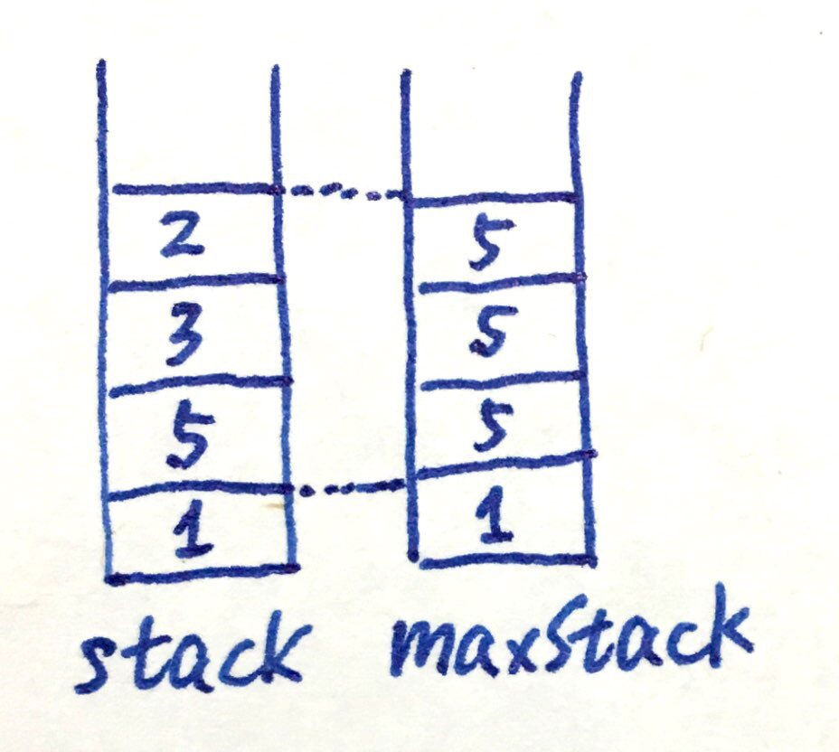
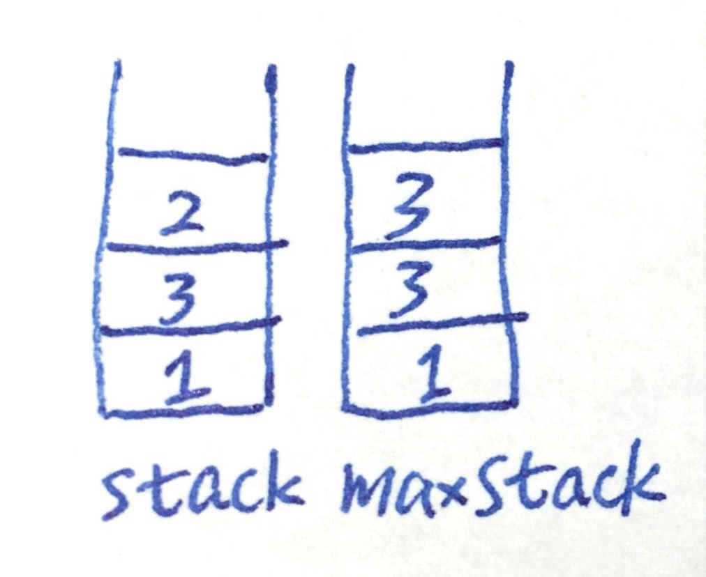

# 716. Max Stack

基础结构：类似min stack，用两个stack。和Min Stack一题不同在于这里不仅要返回max，还要移除max，所以实现逻辑不太一样：



stack和maxStack等高，maxStack高h的位置上存放的是stack高h及以下的最大值。

功能实现：

1. push：把input放进stack，选择input和current max之中的最大值放进maxStack。（可能在maxStack里发生重复，但没关系）

2. pop：对stack进行pop，同时pop maxStack等高的栈顶元素。

3. top：stack.peek().

4. peekMax：因为我们保证maxStack的栈顶是目前的最大值，所以只需maxStack.peek().

5. popMax：重点在此：观察图中例子可知，我们需要让状态变成

   

相当于把max(currently is 5)及以上元素全部pop出去，再依照我们写好的push逻辑把max上层元素再push回去。

```java
class MaxStack {
    
    Stack<Integer> stack;
    Stack<Integer> maxStack;

    /** initialize your data structure here. */
    public MaxStack() {
        stack = new Stack<>();
        maxStack = new Stack<>();
    }
    
    public void push(int x) {
        stack.push(x);
        maxStack.push(maxStack.isEmpty()? x : (maxStack.peek() > x ? maxStack.peek() : x)); // 选择input和max之间的最大值放进maxStack
    }
    
    public int pop() {
        maxStack.pop();
        return stack.pop();
    }
    
    public int top() {
        return stack.peek();
    }
    
    public int peekMax() {
        return maxStack.peek();
    }
    
    public int popMax() {
        
        Stack<Integer> temp = new Stack<>();
        int max = maxStack.peek();
        while(stack.peek() < max) {
            temp.push(pop()); // 1
        }
        pop(); // 2 注意这两个地方是pop()，不是stack.pop()，要使用我们override的方法
        while(!temp.isEmpty()) {
            push(temp.pop()); // 这里也是我们override的push
        }
        return max;
    }
}

/**
 * Your MaxStack object will be instantiated and called as such:
 * MaxStack obj = new MaxStack();
 * obj.push(x);
 * int param_2 = obj.pop();
 * int param_3 = obj.top();
 * int param_4 = obj.peekMax();
 * int param_5 = obj.popMax();
 */
```